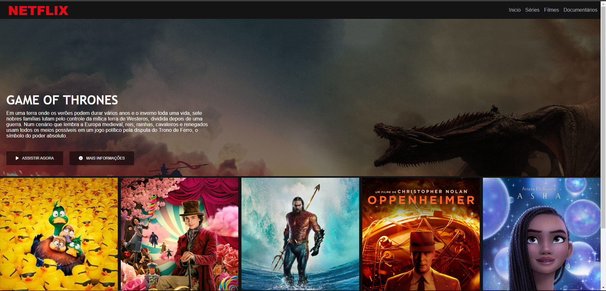

## 🖥️ Projeto

Pagina Clone Netflix responsiva, nesse projeto foi utilizado efeito carrosel usando Jquery. 

## para observar melhor o resultado: https://brbmiranda.github.io/CloneInterfaceNetflix/

## 🚀 Tecnologias

- Javascript
- JQuery
- HTML
- CSS
- Git e Github

